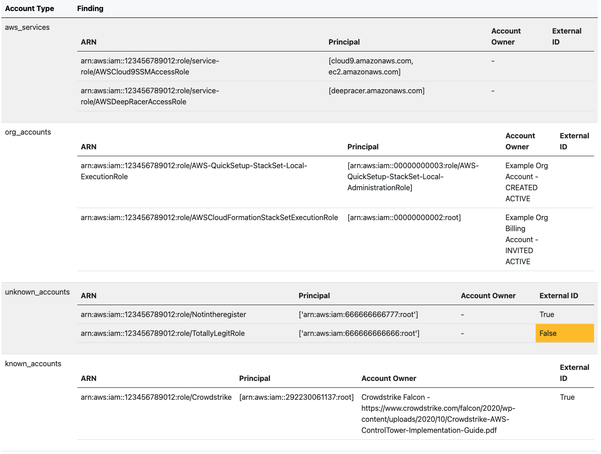

# AWS External Account Scanner

> Xenos, is Greek for stranger.

AWSXenos will assess the trust relationships in all the IAM roles, and resource policies for [several AWS services](#aws-iam-access-analyzer-comparison) in an AWS account and give you a breakdown of all the accounts that have trust relationships to your account. It will also highlight whether the trusts have an [external ID](https://docs.aws.amazon.com/IAM/latest/UserGuide/id_roles_create_for-user_externalid.html) or not.

https://docs.aws.amazon.com/IAM/latest/UserGuide/what-is-access-analyzer.html

This tool reports against the [Trusted Relationship Technique](https://attack.mitre.org/techniques/T1199/) and parts of the [Valid Accounts: Cloud Accounts](https://attack.mitre.org/techniques/T1078/004/) of the ATT&CK Framework. 

* For the "known" accounts list AWSXenos uses a modified version of [known AWS Accounts](https://github.com/fwdcloudsec/known_aws_accounts).
* For the Org accounts list, AWSXenos will query AWS Organizations.
* AWS Services are classified separately.
* Everything else falls under unknown account
* For regional services, e.g. KMS, you'll need to run AWSXenos per region.
* You can configure which services you'd like to assess by providing a [config.yaml](awsxenos/config.yaml) file.

## Example


## Why

Access Analyzer falls short because:

1. You need to enable it in every region. 

2. Identified external entities might be known entities. E.g. a trusted third party vendor or a vendor you no longer trust. An Account number is seldom useful. 

3. Zone of trust is a fixed set of the AWS organisation. You won’t know if a trust between sandbox->prod has been established. 

4. Does not identify AWS Service principals. This is mainly important because of [Wiz's AWSConfig, et al vulnverabilities](http://i.blackhat.com/USA21/Wednesday-Handouts/us-21-Breaking-The-Isolation-Cross-Account-AWS-Vulnerabilities.pdf)


## AWS IAM Access Analyzer comparison 

Comparison based on AWS Documentation [1](https://docs.aws.amazon.com/IAM/latest/UserGuide/reference_aws-services-that-work-with-iam.html) and [2](https://docs.aws.amazon.com/IAM/latest/UserGuide/what-is-access-analyzer.html#what-is-access-analyzer-resource-identification), including services or resources outside of docs, e.g. VPC endpoints.


| Service | AWSXenos | Access Analyzer |
| :--: | :--: | :--: |
| S3 Bucket| :white_check_mark: |  :white_check_mark: |
| S3 Directory Buckets | :x: |  :white_check_mark: |
| S3 Access Points | :x: |  :white_check_mark: |
| S3 Bucket ACLs | :white_check_mark: | :white_check_mark: |
| S3 Glacier | :white_check_mark: | :x: |
| IAM |  :white_check_mark: |  :white_check_mark: |
| KMS |  :white_check_mark: |  :white_check_mark: |
| Secrets Manager |  :white_check_mark: |  :white_check_mark: |
| Lambda | :white_check_mark: |  :white_check_mark: |
| SNS | :white_check_mark: |  :white_check_mark: |
| SQS | :white_check_mark: |  :white_check_mark: |
| RDS Snapshots | :x: |  :white_check_mark: |
| RDS Cluster Snapshots | :x: |  :white_check_mark: |
| ECR | :x: |  :white_check_mark: |
| EFS | :white_check_mark: |  :white_check_mark: |
| DynamoDB streams |  :white_check_mark: |  :white_check_mark: |
| DynamoDB tables |  :white_check_mark: |  :white_check_mark: |
| EBS Snapshots | :x: |  :white_check_mark: |
| EventBridge | :white_check_mark: | :x: |
| EventBridge Schema | :x: | :x: |
| Mediastore | :x: | :x: |
| Glue | :x: | :x: |
| Kinesis Data Streams | :white_check_mark: | :x: |
| Lex v2 | :x: | :x: |
| Migration Hub Orchestrator | :x: | :x: |
| OpenSearch | :white_check_mark: | :x: |
| AWS PCA | :x: | :x: |
| Redshift Serverless | :x: | :x: |
| Serverless Application Repository | :x: | :x: |
| SES v2 | :x: | :x: |
| Incident Manager | :x: | :x: |
| Incident Manager Contacts | :x: | :x: |
| VPC endpoints | :white_check_mark: | :x: |

## How to run

### Cli
```sh
pip install AWSXenos
awsxenos --reporttype HTML -w report.html
awsxenos --reporttype JSON -w report.json
```
You will get an HTML and JSON report.

See [example report](example/example.html)

You can configure the services you care about by using [your own config](awsxenos/config.yaml).

### Library

```python
from awsxenos.scan import PreScan
from awsxenos.report import Report
from awsxenos.s3 import S3
#from awsxenos.iam import IAM

# To run everything based on your config.

prescan = PreScan()
results = load_and_run(config_path, prescan.accounts)
r = Report(results, prescan.known_accounts)

# Per service
prescan = PreScan()
aws_service = S3()
findings = aws_service.fetch(prescan.accounts)
r = Report(s.findings, s.known_accounts)
json_summary = r.JSON_report()
html_summary = r.HTML_report()
```

### IAM Permissions

Permissions required to scan all services.

```json
{
  "Version": "2012-10-17",
  "Statement": [
    {
      "Action": [
        "dynamodb:GetResourcePolicy",
        "dynamodb:ListStreams",
        "dynamodb:ListTables",
        "ec2:DescribeVpcEndpoints",
        "elasticfilesystem:DescribeFileSystemPolicy",
        "elasticfilesystem:DescribeFileSystems",
        "es:DescribeDomains",
        "es:ListDomainNames",
        "events:ListEventBuses",
        "glacier:GetVaultAccessPolicy",
        "glacier:ListVaults",
        "iam:ListRoles",
        "kinesis:GetResourcePolicy",
        "kinesis:ListStreams", 
        "kms:GetKeyPolicy",
        "kms:ListKeys",
        "lambda:GetPolicy",
        "lambda:ListFunctions",
        "organizations:DescribeOrganization",
        "organizations:ListAccounts",
        "s3:GetBucketAcl",
        "s3:GetBucketPolicy",
        "s3:ListAllMyBuckets",
        "secretsmanager:GetResourcePolicy",
        "secretsmanager:ListSecrets",
        "sns:GetTopicAttributes",
        "sns:ListTopics",
        "sqs:GetQueueAttributes",
        "sqs:ListQueues"
      ],
      "Effect": "Allow",
      "Resource": "*"
    }
  ]
}
```

## Development

```sh
python3 -m env venv
source /env/bin/activate
pip install -r requirements.txt
```

1. Create a file with the name of the service.
2. Create a class with the name of the resource that you want from that service
3. Your class must inherit from `Service` and return `Findings`

Example: 

```python
class S3(Service):

    def fetch(self, accounts: Accounts ) -> Findings:
        self._buckets = self.list_account_buckets()
        self.policies = self.get_bucket_policies()
        return super().collate(accounts, self.policies)
```
4. Add your filename and class to the config

---

## FAQ

### Are there false positives?
Yes. AWSXenos doesn't take into consideration Identity or SCP. It assumes that everything else other than the resource or trust policy _has_ access. 

### Is this using an SMT Solver or automated reasoning ?
No. AWSXenos only takes into account resource and IAM trust policies. Maybe in the next project or iteration.

### Why not use [CheckAccessNotGranted](https://docs.aws.amazon.com/access-analyzer/latest/APIReference/API_CheckAccessNotGranted.html) ?
We don't know the set of accounts that shouldn't access the resource or role.

### How does it work ?
AWSXenos currently assesses access based on [https://github.com/Netflix-Skunkworks/policyuniverse](https://github.com/Netflix-Skunkworks/policyuniverse).

## Features
- [x] Use as library
- [x] HTML and JSON output 
- [x] Multi-threaded querying of each service 